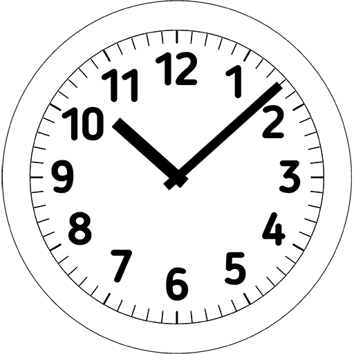
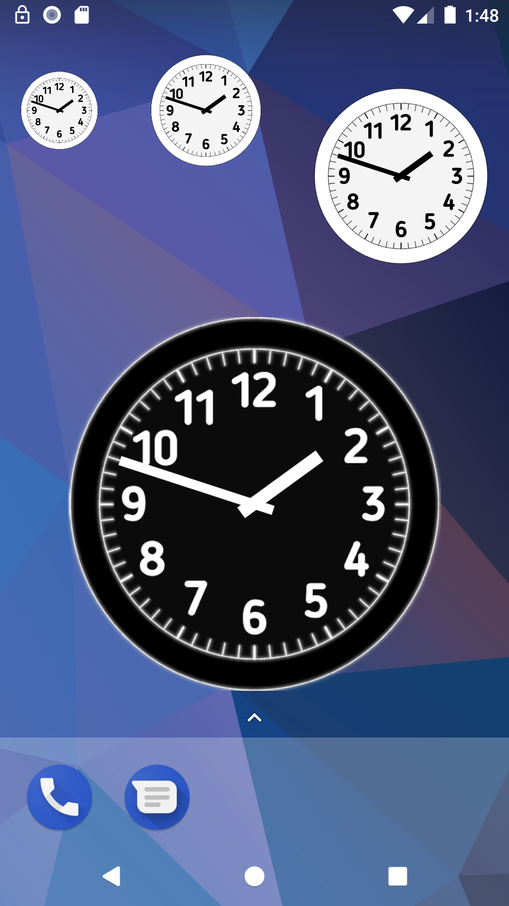

#  Analog Clock Widget

Simple analog clock widget for Android systems

It is resizable and has a clean dial. It uses the built-in AnalogClock widget of Android with a custom dial. There is a light and a dark clock face.

